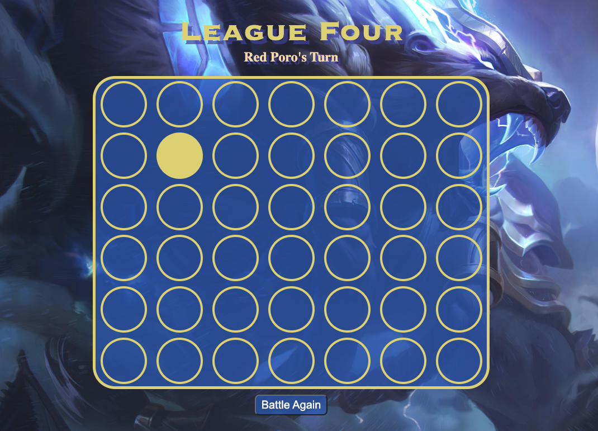
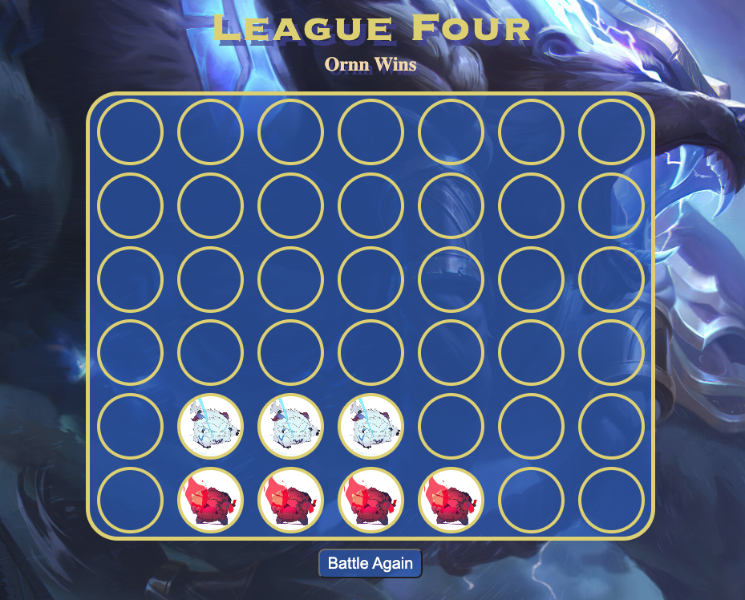
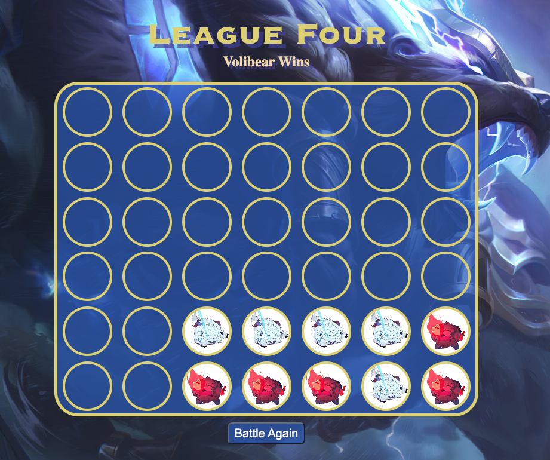
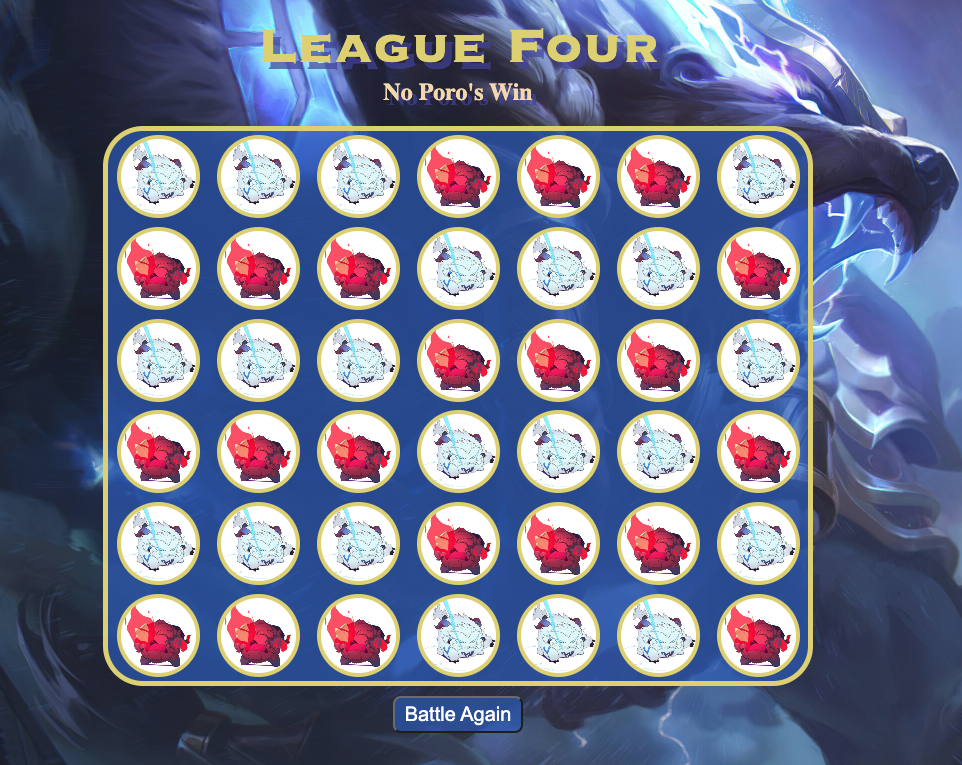

# League of Legends Connect 4
## Date: 01/21/2023
### By: Hyun Bin Yim
#### [LinkedIn](https://www.linkedin.com/in/hyunbinyim/) | [Github](https://github.com/hby77) | [Trello](https://trello.com/b/Vj3YyVmw/project-1) | [Surge](https://league-four.surge.sh/)
***
### ***Description***
#### The purpose of this game is to simply have four in a row, also known as connect 4. Players will take turns in order to tactically place their pieces onto the game board. Whoever has four in a row, whether it is vertically, horizontally, or diagonally, wins the game. If there are no pieces that can be placed onto the board, the game will end as a draw.
***
### ***Technologies Used***
* HTML
* Css
* Javascript
***
### ***Getting Started***
#### Press "Entert" to proceed to the game. Poro Red goes first, and then Poro White. Proceed till the games ends in a winner or draw.
***
### ***Screenshots***
#### Picture of the Game Board

#### Picture of Player 1 Connecting 4

#### Picture of Player 2 Connecting 4

#### Picture of Draw

***
### ***Credits***
#### [Google](https://www.google.com)
#### My classmates && Teachers && Ta's
